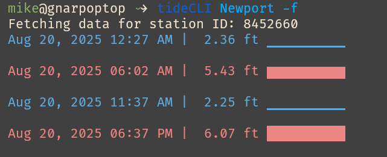

# TidePY - a terminal program to display tides.


## Installation

### Requirements
- Python **3.10+**
- `pip` (latest version recommended)
- `pipx` is suggested for environments where python is managed by the system

### Steps

1. Clone the repository:
```bash
   git clone https://github.com/yourusername/tidePY.git
   cd tidePY
```

2. Install the package:

```bash
   pip install .
#  pipx install .
```


3. Verify installation:

```bash
   tideCLI -h
```

   You should see the CLI help output.

---

## Uninstall

If you ever want to remove it:

```bash
pip uninstall tidePY
pipx uninstall tidePY
```
